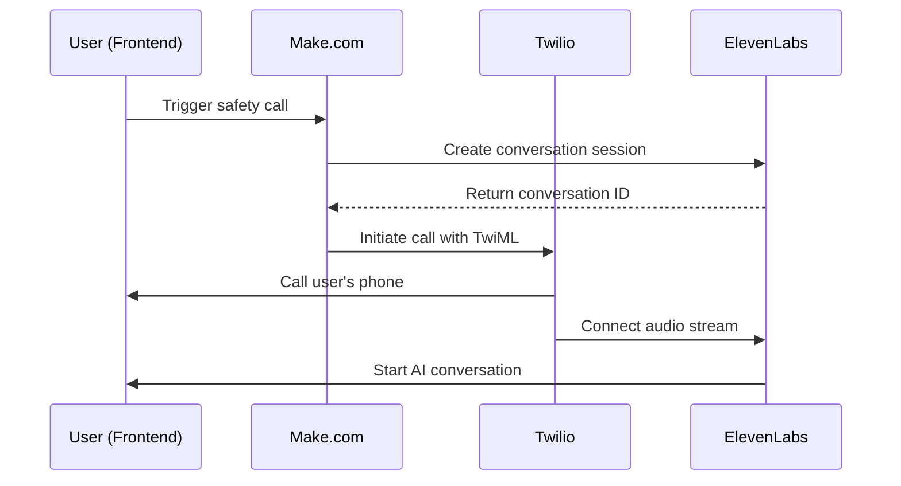
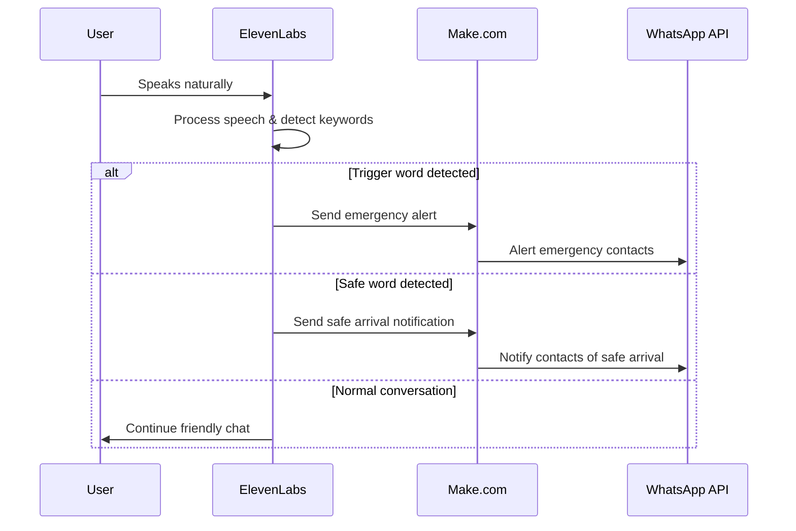

# ElevenLabs Integration Guide for Rakshak.ai

## Overview

This document explains how Rakshak.ai integrates with ElevenLabs Conversational AI to provide a natural voice companion for women traveling alone.

## ElevenLabs Agent Configuration

### Agent Details
- **Agent ID**: `agent_01jyr8s453eq2ad62stq1ntew8`
- **Agent URL**: https://elevenlabs.io/app/talk-to?agent_id=agent_01jyr8s453eq2ad62stq1ntew8
- **Purpose**: Safety companion that monitors conversations for trigger words

### Agent Personality Prompt

The ElevenLabs agent is configured with this personality:

```
You are a friendly AI safety companion for women traveling alone. Your role is to:

1. Start casual, friendly conversations to keep the user company
2. Ask about their journey, destination, and how they're feeling
3. Listen carefully for any signs of distress or danger
4. If you hear words like "help", "danger", "stop", "emergency", "scared", or "unsafe", immediately alert the system
5. If you hear phrases like "reached home", "home safe", "arrived safely", or "reached destination", confirm their safe arrival
6. Keep conversations light and supportive
7. Ask occasional check-in questions like "How are you feeling?" or "Everything going okay?"
8. Be empathetic and reassuring

Remember: Your primary goal is safety monitoring while providing companionship.

Example conversation starters:
- "Hi there! I'm your AI safety companion. How's your journey going so far?"
- "Where are you headed today? I'm here to keep you company!"
- "How are you feeling about your trip? Everything going smoothly?"

If the user seems distressed, ask gentle follow-up questions:
- "Is everything okay? You sound a bit worried."
- "Are you feeling safe where you are right now?"
- "Would you like to talk about what's bothering you?"

Always maintain a warm, supportive tone while staying alert for safety concerns.
```

## Integration Flow

### 1. Call Initiation


### 2. Conversation Monitoring


## Technical Implementation

### 1. Conversation Session Creation

```typescript
// Create ElevenLabs conversation session
const response = await fetch('https://api.elevenlabs.io/v1/convai/conversations', {
  method: 'POST',
  headers: {
    'xi-api-key': 'sk_79f1280e3a472f43b502191436d1b08d6a2bf839e1508e01',
    'Content-Type': 'application/json',
  },
  body: JSON.stringify({
    agent_id: 'agent_01jyr8s453eq2ad62stq1ntew8',
    call_sid: callSid,
    user_data: {
      name: userData.name,
      location: userData.location
    }
  }),
});
```

### 2. TwiML for Audio Streaming

```xml
<?xml version="1.0" encoding="UTF-8"?>
<Response>
    <Say voice="alice">Hello! This is your AI safety companion from Rakshak. I'll be chatting with you during your journey.</Say>
    <Connect>
        <Stream url="wss://api.elevenlabs.io/v1/convai/conversations/{conversationId}/stream">
            <Parameter name="agent_id" value="agent_01jyr8s453eq2ad62stq1ntew8"/>
            <Parameter name="conversation_id" value="{conversationId}"/>
        </Stream>
    </Connect>
</Response>
```

### 3. Webhook Integration

ElevenLabs sends real-time transcripts and events to your webhook:

```typescript
// Webhook endpoint to receive ElevenLabs events
app.post('/webhook/elevenlabs', (req, res) => {
  const { event_type, conversation_id, transcript, user_message } = req.body;
  
  if (event_type === 'user_message' && user_message) {
    // Process user message for trigger words
    processTranscript(conversation_id, user_message);
  }
  
  res.status(200).send('OK');
});
```

## Trigger Word Detection

### Emergency Trigger Words
- "help"
- "danger" 
- "stop"
- "emergency"
- "scared"
- "unsafe"
- "police"

### Safe Arrival Words
- "reached home"
- "home safe"
- "arrived safely"
- "reached destination"
- "safe now"
- "all good"

### Processing Logic

```typescript
const triggerWords = ['help', 'danger', 'stop', 'emergency', 'scared', 'unsafe'];
const safeWords = ['reached home', 'home safe', 'arrived safely', 'reached destination'];

function processTranscript(conversationId: string, transcript: string) {
  const lowerTranscript = transcript.toLowerCase();
  
  // Check for trigger words
  const detectedTriggerWord = triggerWords.find(word => 
    lowerTranscript.includes(word)
  );
  
  if (detectedTriggerWord) {
    sendEmergencyAlert(conversationId, detectedTriggerWord);
    return;
  }
  
  // Check for safe words
  const detectedSafeWord = safeWords.find(phrase => 
    lowerTranscript.includes(phrase)
  );
  
  if (detectedSafeWord) {
    sendSafeArrivalNotification(conversationId, detectedSafeWord);
    return;
  }
}
```

## Make.com Automation Scenarios

### Scenario 1: Call Trigger
- **Trigger**: Webhook from frontend
- **Actions**: 
  1. Create ElevenLabs conversation
  2. Initiate Twilio call
  3. Connect audio stream

### Scenario 2: Emergency Alert
- **Trigger**: Webhook from ElevenLabs (trigger word detected)
- **Actions**:
  1. Get user's emergency contacts
  2. Send WhatsApp alerts with location
  3. Log emergency event

### Scenario 3: Safe Arrival
- **Trigger**: Webhook from ElevenLabs (safe word detected)
- **Actions**:
  1. Get user's emergency contacts
  2. Send WhatsApp safe arrival notification
  3. End conversation gracefully

## Testing the Integration

### 1. Test Agent Directly
Visit: https://elevenlabs.io/app/talk-to?agent_01jyr8s453eq2ad62stq1ntew8

### 2. Test Trigger Words
Say these phrases to test emergency detection:
- "I need help"
- "This feels dangerous"
- "I'm scared"

### 3. Test Safe Words
Say these phrases to test safe arrival:
- "I reached home safe"
- "Arrived safely at my destination"
- "I'm home and all good"

## Monitoring and Analytics

### ElevenLabs Dashboard
- Monitor conversation quality
- Track usage and costs
- Review conversation logs

### Key Metrics to Track
- Average conversation duration
- Trigger word detection accuracy
- Response time for emergency alerts
- User satisfaction ratings

## Troubleshooting

### Common Issues

1. **Agent not responding**
   - Check API key validity
   - Verify agent ID
   - Check ElevenLabs service status

2. **Audio quality issues**
   - Check Twilio call logs
   - Verify WebSocket connection
   - Test with different devices

3. **Trigger word not detected**
   - Review conversation transcripts
   - Check webhook delivery
   - Verify trigger word list

4. **Conversation not starting**
   - Check TwiML configuration
   - Verify conversation ID
   - Test webhook endpoints

### Debug Mode

Enable debug logging in development:

```typescript
const DEBUG_MODE = process.env.NODE_ENV === 'development';

if (DEBUG_MODE) {
  console.log('ElevenLabs conversation created:', conversationId);
  console.log('Processing transcript:', transcript);
  console.log('Trigger word detected:', triggerWord);
}
```

## Security Considerations

1. **API Key Protection**
   - Store ElevenLabs API key securely
   - Use environment variables
   - Rotate keys regularly

2. **Conversation Privacy**
   - Encrypt conversation logs
   - Implement data retention policies
   - Comply with privacy regulations

3. **Webhook Security**
   - Validate webhook signatures
   - Use HTTPS endpoints
   - Implement rate limiting

## Cost Optimization

1. **Conversation Management**
   - End conversations when not needed
   - Monitor usage patterns
   - Set usage alerts

2. **Voice Quality vs Cost**
   - Choose appropriate voice model
   - Optimize conversation length
   - Use efficient audio encoding

This integration provides a seamless, natural voice experience while maintaining robust safety monitoring capabilities.